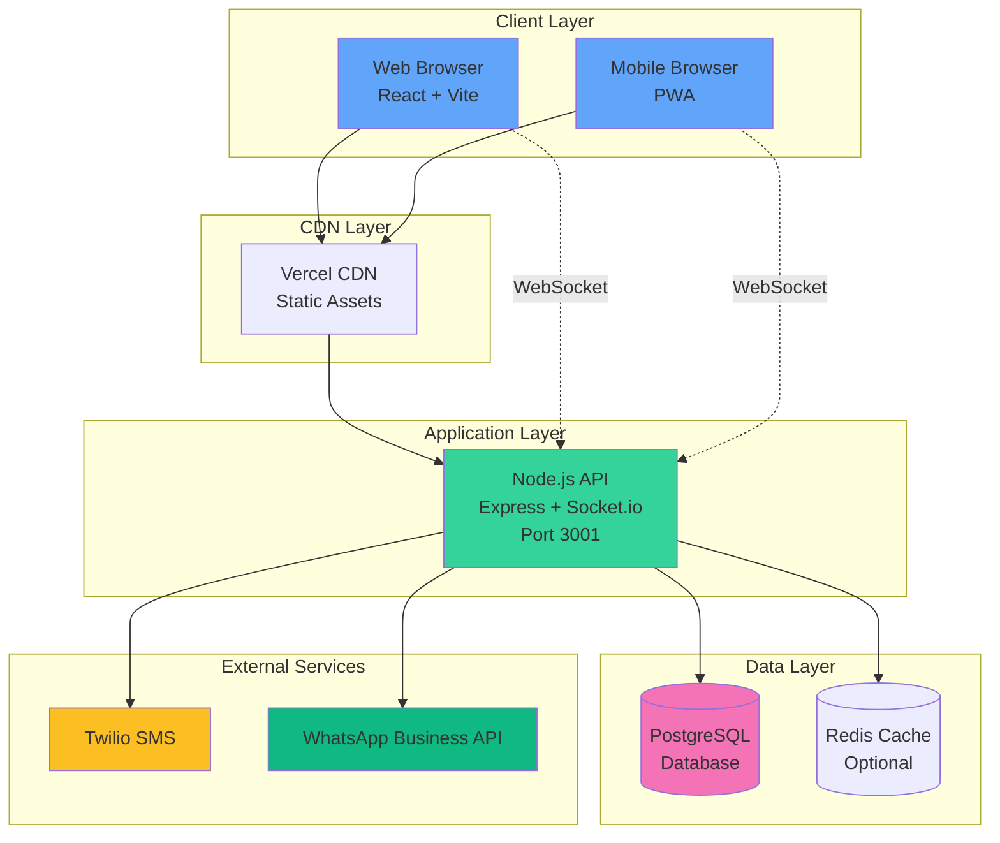
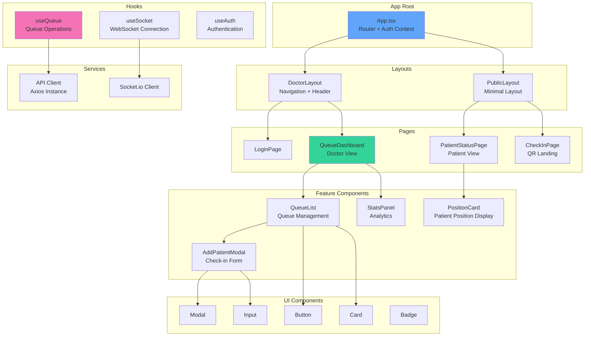
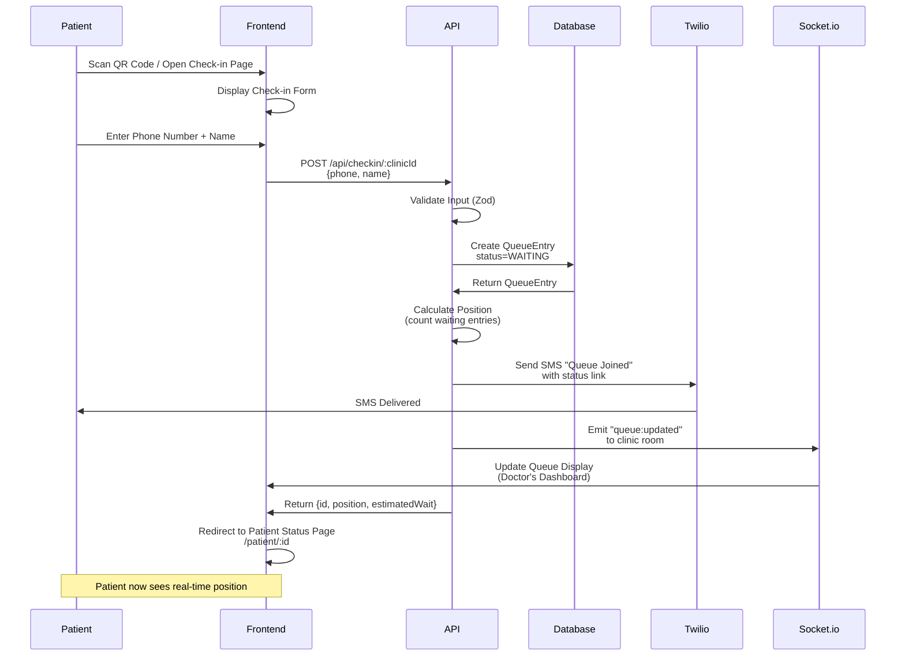
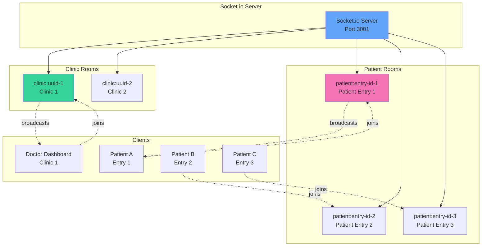
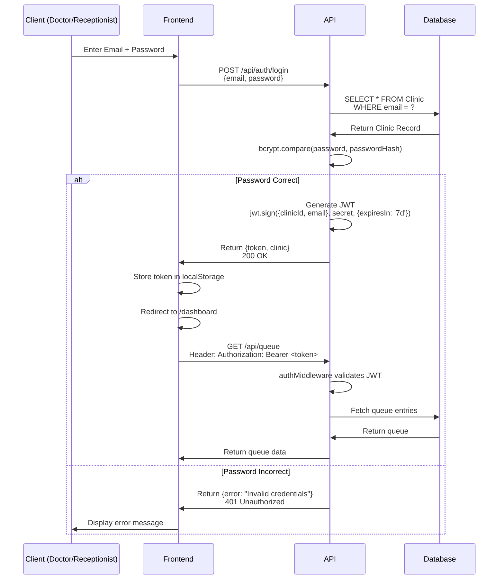
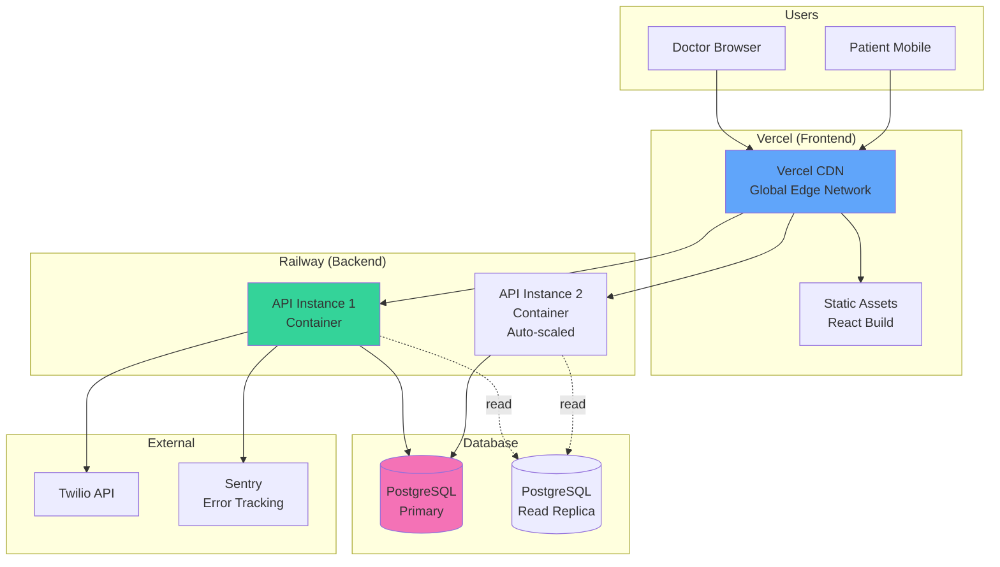

# 05_Technical_Architecture.md

## Overview

This document provides comprehensive architecture diagrams and technical design patterns for DoctorQ. It covers system components, data flows, real-time architecture, and deployment topology.

## Table of Contents

1. [System Architecture](#system-architecture)
2. [Component Hierarchy](#component-hierarchy)
3. [Data Flow Diagrams](#data-flow-diagrams)
4. [Real-time Architecture](#real-time-architecture)
5. [Authentication Flow](#authentication-flow)
6. [API Gateway Patterns](#api-gateway-patterns)
7. [State Management](#state-management)
8. [Caching Strategy](#caching-strategy)
9. [Deployment Architecture](#deployment-architecture)
10. [Scalability Considerations](#scalability-considerations)

---

## System Architecture

### High-Level Overview



### Technology Stack

| Layer | Technology | Purpose |
|-------|-----------|---------|
| **Frontend** | React 18 + TypeScript | UI framework |
| **Styling** | Tailwind CSS | Utility-first styling |
| **Build Tool** | Vite | Fast development & bundling |
| **State Management** | Zustand | Lightweight global state |
| **Real-time Client** | Socket.io-client | WebSocket connections |
| **i18n** | react-i18next | French/Arabic translations |
| **Backend** | Node.js 20 + Express | API server |
| **Real-time Server** | Socket.io | WebSocket server |
| **Validation** | Zod | Schema validation |
| **Database** | PostgreSQL 15 | Relational database |
| **ORM** | Prisma | Database access layer |
| **SMS** | Twilio | SMS notifications |
| **WhatsApp** | Meta Cloud API | WhatsApp messages (P1) |
| **Hosting - Frontend** | Vercel | CDN + Serverless |
| **Hosting - Backend** | Railway/Render | Container hosting |
| **Monitoring** | Sentry | Error tracking |

---

## Component Hierarchy

### Frontend Architecture



### Backend Architecture

```mermaid
graph TD
    subgraph "Entry Point"
        SERVER[server.ts<br/>Express App + Socket.io]
    end

    subgraph "Middleware"
        AUTH_MW[authMiddleware<br/>JWT Validation]
        CORS_MW[CORS]
        RATE_LIMIT[Rate Limiting]
        ERROR_MW[Error Handler]
    end

    subgraph "Routes"
        AUTH_ROUTE[/api/auth]
        QUEUE_ROUTE[/api/queue]
        PATIENT_ROUTE[/api/patient]
        STATS_ROUTE[/api/stats]
        CLINIC_ROUTE[/api/clinic]
    end

    subgraph "Controllers"
        AUTH_CTRL[authController]
        QUEUE_CTRL[queueController]
        PATIENT_CTRL[patientController]
    end

    subgraph "Services"
        QUEUE_SVC[queueService<br/>Business Logic]
        NOTIF_SVC[notificationService<br/>SMS/WhatsApp]
        AUTH_SVC[authService<br/>JWT Generation]
    end

    subgraph "Repositories"
        QUEUE_REPO[queueRepository<br/>Prisma Queries]
        CLINIC_REPO[clinicRepository]
    end

    subgraph "Socket Handlers"
        QUEUE_SOCKET[queueSocketHandler<br/>Room Management]
    end

    subgraph "External Clients"
        TWILIO_CLIENT[Twilio Client]
        WHATSAPP_CLIENT[WhatsApp Client]
    end

    SERVER --> AUTH_MW
    SERVER --> CORS_MW
    SERVER --> RATE_LIMIT
    SERVER --> ERROR_MW
    AUTH_MW --> AUTH_ROUTE
    AUTH_MW --> QUEUE_ROUTE
    QUEUE_ROUTE --> QUEUE_CTRL
    QUEUE_CTRL --> QUEUE_SVC
    QUEUE_SVC --> QUEUE_REPO
    QUEUE_SVC --> NOTIF_SVC
    NOTIF_SVC --> TWILIO_CLIENT
    NOTIF_SVC --> WHATSAPP_CLIENT
    SERVER --> QUEUE_SOCKET

    style SERVER fill:#60A5FA
    style QUEUE_SVC fill:#34D399
    style QUEUE_REPO fill:#F472B6
```

---

## Data Flow Diagrams

### Patient Check-in Flow



### Queue Update Propagation Flow

```mermaid
sequenceDiagram
    participant D as Doctor/Receptionist
    participant F as Frontend
    participant A as API
    participant DB as Database
    participant S as Socket.io
    participant P1 as Patient 1<br/>(Next in Queue)
    participant P2 as Patient 2<br/>(Position 2)

    D->>F: Click "Call Next Patient"
    F->>A: POST /api/queue/next
    A->>DB: Find next WAITING patient
    DB->>A: Return QueueEntry (Position 1)
    A->>DB: Update status to IN_CONSULTATION<br/>Set calledAt timestamp
    A->>DB: Recalculate positions<br/>(Position 2 → Position 1, etc.)
    A->>S: Emit "patient:called"<br/>to patient:${entryId} room
    S->>P1: Update Status "YOUR TURN!"
    A->>S: Emit "position:changed"<br/>to all waiting patients
    S->>P2: Update Position 2→1<br/>Recalculate estimatedWait
    A->>S: Emit "queue:updated"<br/>to clinic room
    S->>F: Update Queue List
    A->>F: Return updated queue
    F->>F: Move patient to "In Consultation" section

    Note over D,P2: Real-time updates without page refresh
```



### Notification Routing Flow

```mermaid
graph TD
    START[Trigger: Patient Added/Called] --> CHECK{Check<br/>checkInMethod}

    CHECK -->|QR_CODE| SMS1[Send SMS via Twilio]
    CHECK -->|MANUAL| SMS2[Send SMS via Twilio]
    CHECK -->|WHATSAPP| WA[Send WhatsApp Message]
    CHECK -->|SMS| SMS3[Send SMS via Twilio]

    SMS1 --> TEMPLATE{Select<br/>Template}
    SMS2 --> TEMPLATE
    SMS3 --> TEMPLATE
    WA --> WA_TEMPLATE{Select<br/>WhatsApp Template}

    TEMPLATE -->|Queue Joined| SMS_JOIN["{{clinicName}} - Vous êtes #{{position}}"]
    TEMPLATE -->|Almost Turn| SMS_ALMOST["⚠️ Plus que {{remaining}} patient(s)"]
    TEMPLATE -->|Your Turn| SMS_TURN["🎉 C'EST VOTRE TOUR!"]

    WA_TEMPLATE -->|Queue Joined| WA_JOIN[WhatsApp: Queue Joined Message]
    WA_TEMPLATE -->|Almost Turn| WA_ALMOST[WhatsApp: Almost Turn]
    WA_TEMPLATE -->|Your Turn| WA_TURN[WhatsApp: Your Turn]

    SMS_JOIN --> I18N[Apply i18n<br/>French/Arabic]
    SMS_ALMOST --> I18N
    SMS_TURN --> I18N
    WA_JOIN --> I18N
    WA_ALMOST --> I18N
    WA_TURN --> I18N

    I18N --> SEND[Send Notification]
    SEND --> LOG[Log to Database]
    SEND --> RETRY{Delivery<br/>Success?}
    RETRY -->|Yes| END[Complete]
    RETRY -->|No| RETRY_LOGIC[Retry 3x<br/>Exponential Backoff]
    RETRY_LOGIC --> FALLBACK[Mark Failed<br/>Alert Admin]

    style START fill:#60A5FA
    style SEND fill:#34D399
    style FALLBACK fill:#F87171
```



---

## Real-time Architecture

### Socket.io Room Structure



### Socket.io Event Patterns

**Server → Client Events:**

| Event | Room | Payload | Trigger |
|-------|------|---------|---------|
| `queue:updated` | `clinic:${clinicId}` | `{ queue: QueueEntry[], stats }` | Patient added/removed/status changed |
| `patient:called` | `patient:${entryId}` | `{ position, status }` | Doctor calls next patient |
| `position:changed` | `patient:${entryId}` | `{ newPosition, estimatedWait }` | Queue position recalculated |
| `connection:status` | Individual socket | `{ connected: boolean }` | Connection state change |

**Client → Server Events:**

| Event | Payload | Purpose |
|-------|---------|---------|
| `join:clinic` | `{ clinicId, token }` | Doctor/receptionist joins clinic room |
| `join:patient` | `{ entryId }` | Patient joins personal room for updates |
| `leave:clinic` | `{ clinicId }` | Leave clinic room |
| `leave:patient` | `{ entryId }` | Leave patient room |

**Implementation Example:**

```typescript
// Backend: apps/api/src/socket/queueSocketHandler.ts
import { Server, Socket } from 'socket.io';

export function setupQueueSocketHandlers(io: Server) {
  io.on('connection', (socket: Socket) => {
    console.log('Client connected:', socket.id);

    // Doctor/Receptionist joins clinic room
    socket.on('join:clinic', async ({ clinicId, token }) => {
      // Verify JWT token
      const clinic = await verifyClinicToken(token);
      if (clinic?.id !== clinicId) {
        socket.emit('error', { message: 'Unauthorized' });
        return;
      }

      // Join clinic room
      socket.join(`clinic:${clinicId}`);
      console.log(`Socket ${socket.id} joined clinic:${clinicId}`);

      // Send current queue state
      const queue = await queueService.getTodayQueue(clinicId);
      socket.emit('queue:updated', queue);
    });

    // Patient joins personal room
    socket.on('join:patient', async ({ entryId }) => {
      // Verify entry exists
      const entry = await queueRepository.findById(entryId);
      if (!entry) {
        socket.emit('error', { message: 'Entry not found' });
        return;
      }

      // Join patient room
      socket.join(`patient:${entryId}`);
      console.log(`Socket ${socket.id} joined patient:${entryId}`);

      // Send current position
      socket.emit('position:changed', {
        newPosition: entry.position,
        estimatedWait: calculateEstimatedWait(entry.position)
      });
    });

    socket.on('disconnect', () => {
      console.log('Client disconnected:', socket.id);
    });
  });
}

// Usage in queue service
export async function callNextPatient(clinicId: string) {
  // ... database updates ...

  // Emit to patient's room
  io.to(`patient:${nextEntry.id}`).emit('patient:called', {
    position: 1,
    status: 'IN_CONSULTATION'
  });

  // Emit to clinic room
  io.to(`clinic:${clinicId}`).emit('queue:updated', {
    queue: updatedQueue,
    stats: calculateStats(updatedQueue)
  });

  // Emit position updates to all affected patients
  for (const entry of recalculatedEntries) {
    io.to(`patient:${entry.id}`).emit('position:changed', {
      newPosition: entry.position,
      estimatedWait: calculateEstimatedWait(entry.position)
    });
  }
}
```

### Fallback to Polling

For clients with WebSocket connection issues:

```typescript
// Frontend: apps/web/src/hooks/useQueue.ts
export function useQueue(clinicId: string) {
  const [queue, setQueue] = useState<QueueEntry[]>([]);
  const [isConnected, setIsConnected] = useState(false);
  const socket = useSocket();

  useEffect(() => {
    // Try WebSocket first
    socket.on('connect', () => {
      setIsConnected(true);
      socket.emit('join:clinic', { clinicId, token: getToken() });
    });

    socket.on('queue:updated', (data) => {
      setQueue(data.queue);
    });

    // Fallback: Poll if disconnected for >10 seconds
    const pollInterval = setInterval(() => {
      if (!isConnected) {
        fetchQueue(clinicId).then(setQueue);
      }
    }, 10000);

    return () => {
      clearInterval(pollInterval);
      socket.emit('leave:clinic', { clinicId });
    };
  }, [clinicId, socket, isConnected]);

  return { queue, isConnected };
}
```

---

## Authentication Flow

### JWT Authentication Sequence



### Auth Middleware Implementation

```typescript
// Backend: apps/api/src/middleware/auth.middleware.ts
import jwt from 'jsonwebtoken';
import { Request, Response, NextFunction } from 'express';

export interface AuthRequest extends Request {
  clinic?: {
    id: string;
    email: string;
  };
}

export function authMiddleware(
  req: AuthRequest,
  res: Response,
  next: NextFunction
) {
  // Extract token from Authorization header
  const authHeader = req.headers.authorization;
  if (!authHeader || !authHeader.startsWith('Bearer ')) {
    return res.status(401).json({ error: 'No token provided' });
  }

  const token = authHeader.substring(7); // Remove "Bearer "

  try {
    // Verify token
    const decoded = jwt.verify(token, process.env.JWT_SECRET!) as {
      clinicId: string;
      email: string;
    };

    // Attach clinic info to request
    req.clinic = {
      id: decoded.clinicId,
      email: decoded.email
    };

    next();
  } catch (error) {
    if (error.name === 'TokenExpiredError') {
      return res.status(401).json({ error: 'Token expired' });
    }
    return res.status(401).json({ error: 'Invalid token' });
  }
}

// Usage in routes
app.get('/api/queue', authMiddleware, async (req: AuthRequest, res) => {
  const clinicId = req.clinic!.id;
  const queue = await queueService.getTodayQueue(clinicId);
  res.json(queue);
});
```

### Protected Route Pattern (Frontend)

```typescript
// Frontend: apps/web/src/components/ProtectedRoute.tsx
import { Navigate, Outlet } from 'react-router-dom';
import { useAuth } from '../hooks/useAuth';

export function ProtectedRoute() {
  const { isAuthenticated, isLoading } = useAuth();

  if (isLoading) {
    return <div>Loading...</div>;
  }

  if (!isAuthenticated) {
    return <Navigate to="/login" replace />;
  }

  return <Outlet />;
}

// Usage in router
<Route element={<ProtectedRoute />}>
  <Route path="/dashboard" element={<QueueDashboard />} />
  <Route path="/settings" element={<SettingsPage />} />
</Route>
```

---

## API Gateway Patterns

### Rate Limiting

```typescript
// Backend: apps/api/src/middleware/rateLimit.middleware.ts
import rateLimit from 'express-rate-limit';

// Public endpoints (check-in, patient status)
export const publicLimiter = rateLimit({
  windowMs: 60 * 60 * 1000, // 1 hour
  max: 100, // 100 requests per hour per IP
  message: 'Too many requests, please try again later',
  standardHeaders: true,
  legacyHeaders: false,
});

// Authenticated endpoints
export const authLimiter = rateLimit({
  windowMs: 60 * 60 * 1000, // 1 hour
  max: 1000, // 1000 requests per hour
  keyGenerator: (req: AuthRequest) => req.clinic?.id || req.ip,
  message: 'Rate limit exceeded',
});

// SMS sending (prevent abuse)
export const smsLimiter = rateLimit({
  windowMs: 24 * 60 * 60 * 1000, // 24 hours
  max: 500, // 500 SMS per clinic per day
  keyGenerator: (req: AuthRequest) => req.clinic?.id || req.ip,
  message: 'Daily SMS limit exceeded',
});

// Apply in routes
app.post('/api/checkin/:clinicId', publicLimiter, checkInController);
app.get('/api/queue', authLimiter, authMiddleware, queueController);
app.post('/api/queue/:id/notify', smsLimiter, authMiddleware, notifyController);
```

### CORS Configuration

```typescript
// Backend: apps/api/src/index.ts
import cors from 'cors';

const corsOptions = {
  origin: process.env.CORS_ORIGIN || 'http://localhost:5173',
  credentials: true,
  methods: ['GET', 'POST', 'PATCH', 'DELETE'],
  allowedHeaders: ['Content-Type', 'Authorization'],
};

app.use(cors(corsOptions));
```

### Error Handling Middleware

```typescript
// Backend: apps/api/src/middleware/errorHandler.middleware.ts
import { Request, Response, NextFunction } from 'express';
import { ZodError } from 'zod';
import { Prisma } from '@prisma/client';

export function errorHandler(
  err: Error,
  req: Request,
  res: Response,
  next: NextFunction
) {
  console.error('Error:', err);

  // Zod validation errors
  if (err instanceof ZodError) {
    return res.status(400).json({
      error: {
        code: 'VALIDATION_ERROR',
        message: 'Invalid request data',
        details: err.errors.map(e => ({
          path: e.path.join('.'),
          message: e.message
        }))
      }
    });
  }

  // Prisma errors
  if (err instanceof Prisma.PrismaClientKnownRequestError) {
    if (err.code === 'P2002') {
      return res.status(409).json({
        error: {
          code: 'DUPLICATE_ENTRY',
          message: 'Resource already exists'
        }
      });
    }
    if (err.code === 'P2025') {
      return res.status(404).json({
        error: {
          code: 'NOT_FOUND',
          message: 'Resource not found'
        }
      });
    }
  }

  // Generic server error
  res.status(500).json({
    error: {
      code: 'INTERNAL_ERROR',
      message: process.env.NODE_ENV === 'production'
        ? 'Internal server error'
        : err.message
    }
  });
}
```

---

## State Management

### Zustand Store Structure

```typescript
// Frontend: apps/web/src/stores/queueStore.ts
import { create } from 'zustand';
import { QueueEntry, QueueStats } from '@/types';

interface QueueStore {
  // State
  queue: QueueEntry[];
  stats: QueueStats | null;
  isLoading: boolean;
  error: string | null;

  // Actions
  setQueue: (queue: QueueEntry[]) => void;
  addPatient: (entry: QueueEntry) => void;
  updatePatientStatus: (id: string, status: QueueStatus) => void;
  removePatient: (id: string) => void;
  setStats: (stats: QueueStats) => void;
  setError: (error: string | null) => void;
}

export const useQueueStore = create<QueueStore>((set) => ({
  queue: [],
  stats: null,
  isLoading: false,
  error: null,

  setQueue: (queue) => set({ queue, isLoading: false }),

  addPatient: (entry) => set((state) => ({
    queue: [...state.queue, entry]
  })),

  updatePatientStatus: (id, status) => set((state) => ({
    queue: state.queue.map(entry =>
      entry.id === id ? { ...entry, status } : entry
    )
  })),

  removePatient: (id) => set((state) => ({
    queue: state.queue.filter(entry => entry.id !== id)
  })),

  setStats: (stats) => set({ stats }),
  setError: (error) => set({ error, isLoading: false }),
}));
```

### React Context for Auth

```typescript
// Frontend: apps/web/src/contexts/AuthContext.tsx
import { createContext, useContext, useState, useEffect } from 'react';
import { Clinic } from '@/types';
import { authApi } from '@/lib/api';

interface AuthContextValue {
  clinic: Clinic | null;
  isAuthenticated: boolean;
  isLoading: boolean;
  login: (email: string, password: string) => Promise<void>;
  logout: () => void;
}

const AuthContext = createContext<AuthContextValue | null>(null);

export function AuthProvider({ children }: { children: React.ReactNode }) {
  const [clinic, setClinic] = useState<Clinic | null>(null);
  const [isLoading, setIsLoading] = useState(true);

  useEffect(() => {
    // Check for existing token on mount
    const token = localStorage.getItem('token');
    if (token) {
      authApi.verifyToken(token)
        .then(setClinic)
        .catch(() => localStorage.removeItem('token'))
        .finally(() => setIsLoading(false));
    } else {
      setIsLoading(false);
    }
  }, []);

  const login = async (email: string, password: string) => {
    const { token, clinic } = await authApi.login(email, password);
    localStorage.setItem('token', token);
    setClinic(clinic);
  };

  const logout = () => {
    localStorage.removeItem('token');
    setClinic(null);
  };

  return (
    <AuthContext.Provider value={{
      clinic,
      isAuthenticated: !!clinic,
      isLoading,
      login,
      logout
    }}>
      {children}
    </AuthContext.Provider>
  );
}

export const useAuth = () => useContext(AuthContext)!;
```

---

## Caching Strategy

### Redis for Queue State (Future Enhancement)

```typescript
// Backend: apps/api/src/lib/redis.ts
import Redis from 'ioredis';

const redis = new Redis(process.env.REDIS_URL);

// Cache today's queue for 30 seconds
export async function getCachedQueue(clinicId: string): Promise<QueueEntry[] | null> {
  const cached = await redis.get(`queue:${clinicId}:today`);
  return cached ? JSON.parse(cached) : null;
}

export async function cacheQueue(clinicId: string, queue: QueueEntry[]) {
  await redis.setex(
    `queue:${clinicId}:today`,
    30, // 30 seconds TTL
    JSON.stringify(queue)
  );
}

export async function invalidateQueueCache(clinicId: string) {
  await redis.del(`queue:${clinicId}:today`);
}

// Usage in service
export async function getTodayQueue(clinicId: string) {
  // Try cache first
  const cached = await getCachedQueue(clinicId);
  if (cached) return cached;

  // Fetch from database
  const queue = await queueRepository.findTodayQueue(clinicId);

  // Cache result
  await cacheQueue(clinicId, queue);

  return queue;
}
```

### Browser Cache for Static Assets

```typescript
// Frontend: apps/web/vite.config.ts
export default defineConfig({
  build: {
    rollupOptions: {
      output: {
        // Content-based hashing for cache busting
        entryFileNames: 'assets/[name].[hash].js',
        chunkFileNames: 'assets/[name].[hash].js',
        assetFileNames: 'assets/[name].[hash].[ext]'
      }
    }
  }
});

// Vercel configuration for caching
// vercel.json
{
  "headers": [
    {
      "source": "/assets/(.*)",
      "headers": [
        {
          "key": "Cache-Control",
          "value": "public, max-age=31536000, immutable"
        }
      ]
    }
  ]
}
```

---

## Deployment Architecture

### Production Topology



### Environment Separation

| Environment | Frontend | Backend | Database | Purpose |
|-------------|----------|---------|----------|---------|
| **Development** | localhost:5173 | localhost:3001 | Local PostgreSQL | Local development |
| **Staging** | staging.doctorq.tn | api-staging.doctorq.tn | Staging DB | Testing before production |
| **Production** | doctorq.tn | api.doctorq.tn | Production DB | Live system |

---

## Scalability Considerations

### Horizontal Scaling

**Backend API:**
- Stateless design allows multiple instances
- Socket.io with Redis adapter for multi-instance support
- Load balancer distributes WebSocket connections

```typescript
// Socket.io with Redis adapter (for multi-instance)
import { createAdapter } from '@socket.io/redis-adapter';
import { createClient } from 'redis';

const pubClient = createClient({ url: process.env.REDIS_URL });
const subClient = pubClient.duplicate();

await Promise.all([pubClient.connect(), subClient.connect()]);

io.adapter(createAdapter(pubClient, subClient));
```

### Database Optimization

**Indexes:**
- `[clinicId, status]` - Fast queue filtering
- `[clinicId, arrivedAt]` - Position calculation
- `[patientPhone]` - Duplicate check

**Query Optimization:**
```typescript
// Efficient queue fetch (uses indexes)
const queue = await prisma.queueEntry.findMany({
  where: {
    clinicId,
    status: { in: ['WAITING', 'NOTIFIED'] }
  },
  orderBy: { arrivedAt: 'asc' },
  select: {
    id: true,
    patientName: true,
    position: true,
    status: true,
    arrivedAt: true
  }
});
```

### CDN & Asset Optimization

- Static assets served from Vercel Edge Network (170+ locations)
- Image optimization with Vercel Image Optimization
- Code splitting by route (React.lazy)
- Tree shaking removes unused code

---

## Next Steps

- **Implementation**: See [15_Project_Phases.md](./15_Project_Phases.md) for phased development plan
- **API Details**: See [11_API_Specification.md](./11_API_Specification.md) for endpoint specifications
- **Testing**: See [12_Testing_Plan.md](./12_Testing_Plan.md) for testing architecture
