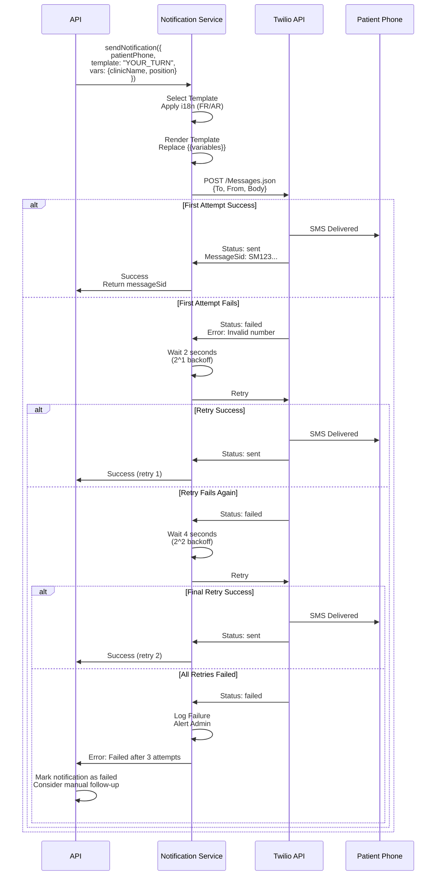
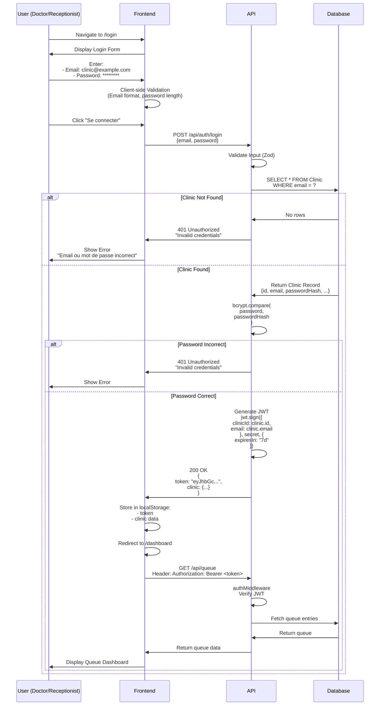

# 07_User_Flow_Diagrams.md

## Overview

This document contains comprehensive visual user journey diagrams using Mermaid syntax. These diagrams illustrate all critical user flows in the DoctorQ system, from patient check-in through consultation completion.

## Table of Contents

1. [Patient Check-in Flows](#patient-check-in-flows)
2. [Patient Waiting Experience](#patient-waiting-experience)
3. [Doctor Queue Management](#doctor-queue-management)
4. [Notification Flow](#notification-flow)
5. [Authentication Flow](#authentication-flow)
6. [Error Scenarios](#error-scenarios)

---

## Patient Check-in Flows

### Complete Check-in Journey (3 Methods)

```mermaid
graph TD
    START[Patient Arrives at Clinic] --> METHOD{How to Check In?}

    METHOD -->|Sees QR Code Poster| QR[Scan QR Code<br/>with Phone Camera]
    METHOD -->|Receptionist Adds| MANUAL[Receptionist Enters<br/>Patient Info]
    METHOD -->|WhatsApp| WA[Send "ARRIVER"<br/>to Clinic WhatsApp]

    %% QR Code Flow
    QR --> QR_LAND[QR Landing Page<br/>/checkin/:clinicId]
    QR_LAND --> QR_FORM[Enter Phone Number<br/>Optional: Name]
    QR_FORM --> QR_VALID{Phone Number<br/>Valid?}
    QR_VALID -->|No| QR_ERROR[Show Error<br/>Tunisia Format Required]
    QR_ERROR --> QR_FORM
    QR_VALID -->|Yes| QR_SUBMIT[Submit Check-in Form]
    QR_SUBMIT --> ADD_QUEUE_QR[Add to Queue<br/>checkInMethod=QR_CODE]

    %% Manual Flow
    MANUAL --> MANUAL_FORM[Receptionist Opens<br/>Add Patient Modal]
    MANUAL_FORM --> MANUAL_INPUT[Enter Phone + Name<br/>+ Visit Reason]
    MANUAL_INPUT --> MANUAL_SUBMIT[Click Add to Queue]
    MANUAL_SUBMIT --> ADD_QUEUE_MANUAL[Add to Queue<br/>checkInMethod=MANUAL]

    %% WhatsApp Flow
    WA --> WA_RECEIVE[WhatsApp Bot Receives<br/>"ARRIVER" Message]
    WA_RECEIVE --> WA_VERIFY{Clinic<br/>Found?}
    WA_VERIFY -->|No| WA_ERROR[Reply: Clinic Not Found]
    WA_VERIFY -->|Yes| WA_CONFIRM[Reply: Confirmation Message<br/>"Vous êtes ajouté"]
    WA_CONFIRM --> ADD_QUEUE_WA[Add to Queue<br/>checkInMethod=WHATSAPP]

    %% Common: Add to Queue
    ADD_QUEUE_QR --> CALC_POS[Calculate Position<br/>Count Waiting Patients]
    ADD_QUEUE_MANUAL --> CALC_POS
    ADD_QUEUE_WA --> CALC_POS

    CALC_POS --> SEND_NOTIF{Notification<br/>Routing}

    %% Notification Routing Based on Check-in Method
    SEND_NOTIF -->|QR_CODE| SMS_QR[Send SMS<br/>Queue Joined + Link]
    SEND_NOTIF -->|MANUAL| SMS_MANUAL[Send SMS<br/>Queue Joined + Link]
    SEND_NOTIF -->|WHATSAPP| WA_MSG[Send WhatsApp<br/>Queue Joined + Link]

    SMS_QR --> PATIENT_PAGE[Redirect to<br/>Patient Status Page]
    SMS_MANUAL --> PATIENT_NOTIFIED[Patient Receives SMS]
    WA_MSG --> PATIENT_NOTIFIED

    PATIENT_NOTIFIED --> PATIENT_OPEN[Patient Opens Link<br/>/patient/:entryId]
    PATIENT_OPEN --> PATIENT_PAGE

    PATIENT_PAGE --> SHOW_STATUS[Display:<br/>Position, Estimated Wait,<br/>Real-time Updates]

    style START fill:#60A5FA
    style ADD_QUEUE_QR fill:#34D399
    style ADD_QUEUE_MANUAL fill:#34D399
    style ADD_QUEUE_WA fill:#34D399
    style SHOW_STATUS fill:#10B981
```

### QR Code Check-in (Detailed)

```mermaid
sequenceDiagram
    participant P as Patient
    participant QR as QR Code Poster
    participant F as Frontend
    participant A as API
    participant DB as Database
    participant T as Twilio SMS

    P->>QR: Scan QR Code<br/>with Camera App
    QR->>F: Open URL<br/>https://doctorq.tn/checkin/:clinicId
    F->>F: Load Check-in Page<br/>Pre-fill clinic info
    F->>P: Display Form<br/>(Phone Required, Name Optional)
    P->>F: Enter +216 98 123 456
    F->>F: Validate Phone<br/>(Tunisia format)
    P->>F: Click "Rejoindre la file"
    F->>A: POST /api/checkin/:clinicId<br/>{phone: "+21698123456", name: ""}
    A->>A: Validate Input (Zod)
    A->>DB: Check Duplicate<br/>(same phone, today, WAITING)

    alt Already in Queue
        DB->>A: Found Existing Entry
        A->>F: 409 Conflict<br/>"Already in queue"
        F->>P: Show Message<br/>"Vous êtes déjà dans la file"
    else New Entry
        DB->>A: No Duplicate
        A->>DB: INSERT QueueEntry<br/>status=WAITING, checkInMethod=QR_CODE
        A->>DB: Count WAITING entries
        DB->>A: Position = 5
        A->>T: Send SMS<br/>"{{clinicName}} - Vous êtes #5"<br/>+ Link
        T->>P: SMS Delivered
        A->>F: 201 Created<br/>{id, position: 5, estimatedWait: 75}
        F->>F: Redirect to<br/>/patient/:id
        F->>P: Show Position Page<br/>Position #5, ~75 min wait
    end
```



### Manual Check-in by Receptionist

```mermaid
sequenceDiagram
    participant P as Patient (arrives)
    participant R as Receptionist
    participant F as Frontend (Dashboard)
    participant A as API
    participant DB as Database
    participant T as Twilio SMS

    P->>R: Arrives at Reception
    R->>F: Click "Ajouter un Patient"
    F->>R: Open Modal<br/>Add Patient Form
    R->>F: Enter:<br/>- Phone: +216 98 123 456<br/>- Name: Ahmed Ben Salem<br/>- Reason: Consultation
    R->>F: Click "Ajouter"
    F->>A: POST /api/queue<br/>{patientPhone, patientName, checkInMethod: MANUAL}
    A->>DB: INSERT QueueEntry<br/>status=WAITING
    DB->>A: QueueEntry Created
    A->>DB: Recalculate Positions
    A->>T: Send SMS (French)<br/>"Dr. {{name}} - Vous êtes #{{position}}"
    T->>P: SMS Delivered
    A->>F: Return QueueEntry
    F->>R: Close Modal<br/>Show Success Toast
    F->>F: Add Patient to Queue List<br/>(Real-time via Socket.io)
    R->>P: "You're checked in,<br/>SMS sent to your phone"
```



---

## Patient Waiting Experience

### Patient Status Page Lifecycle

```mermaid
stateDiagram-v2
    [*] --> CheckedIn: Patient checks in

    CheckedIn --> Waiting: Position assigned
    Waiting --> PositionUpdated: Another patient called
    PositionUpdated --> Waiting: Update position display

    Waiting --> AlmostTurn: Position <= 2
    AlmostTurn --> NotificationSent: SMS/WhatsApp sent
    NotificationSent --> AlmostReady: Patient sees "⚠️ Presque votre tour"

    AlmostReady --> YourTurn: Doctor calls next
    YourTurn --> TurnNotification: SMS "🎉 C'EST VOTRE TOUR!"
    TurnNotification --> InConsultation: Status page turns green

    InConsultation --> Completed: Doctor marks complete
    Completed --> [*]: Exit flow

    Waiting --> NoShow: Patient doesn't arrive
    AlmostReady --> NoShow: Doesn't respond
    NoShow --> [*]

    Waiting --> Cancelled: Patient cancels
    Cancelled --> [*]

    note right of Waiting
        Patient sees:
        - Position #5
        - ~75 min wait
        - Auto-refresh every 30s
    end note

    note right of AlmostTurn
        Triggers when:
        position <= notifyAtPosition
        (default: 2)
    end note

    note right of YourTurn
        Page visual changes:
        - Green background
        - Large "YOUR TURN!"
        - Clinic directions
    end note
```



### Patient Status Page Flow (Interactive)

```mermaid
graph TD
    OPEN[Patient Opens Link<br/>/patient/:entryId] --> FETCH[Fetch Entry Data<br/>GET /api/patient/:entryId]
    FETCH --> VERIFY{Entry<br/>Exists?}

    VERIFY -->|No| ERROR_404[Show 404 Error<br/>"Entry not found"]
    ERROR_404 --> END[End]

    VERIFY -->|Yes| LOAD[Display Status Page]
    LOAD --> JOIN_ROOM[Join Socket.io Room<br/>patient:entryId]

    JOIN_ROOM --> CHECK_STATUS{Current<br/>Status?}

    CHECK_STATUS -->|WAITING| SHOW_WAITING[Display Position Card<br/>- Position #X<br/>- Est. Wait Y min<br/>- Progress Bar]
    CHECK_STATUS -->|NOTIFIED| SHOW_ALMOST[Display "Almost Turn"<br/>⚠️ Warning Style<br/>Get Ready]
    CHECK_STATUS -->|IN_CONSULTATION| SHOW_TURN[Display "Your Turn"<br/>🎉 Green Background<br/>GO TO CLINIC!]
    CHECK_STATUS -->|COMPLETED| SHOW_DONE[Display "Completed"<br/>Thank You Message]
    CHECK_STATUS -->|NO_SHOW| SHOW_NOSHOW[Display "No Show"<br/>Contact Clinic]
    CHECK_STATUS -->|CANCELLED| SHOW_CANCEL[Display "Cancelled"]

    SHOW_WAITING --> LISTEN[Listen for Socket.io Events]
    SHOW_ALMOST --> LISTEN
    SHOW_TURN --> CONSULT[Patient Goes to Consultation]

    LISTEN --> EVENT{Event<br/>Received?}
    EVENT -->|position:changed| UPDATE_POS[Update Position Display<br/>Recalculate Wait Time]
    EVENT -->|patient:called| CALLED[Status = YOUR TURN<br/>Play Notification Sound]

    UPDATE_POS --> SHOW_WAITING
    CALLED --> SHOW_TURN

    CONSULT --> COMPLETE[Doctor Marks Complete]
    COMPLETE --> SHOW_DONE

    SHOW_DONE --> END
    SHOW_NOSHOW --> END
    SHOW_CANCEL --> END

    %% Auto-refresh fallback
    SHOW_WAITING -.Poll every 30s.-> FETCH_REFRESH[Fetch Latest Position]
    FETCH_REFRESH -.Update.-> SHOW_WAITING

    style OPEN fill:#60A5FA
    style SHOW_TURN fill:#10B981
    style SHOW_DONE fill:#34D399
```

---

## Doctor Queue Management

### Queue Dashboard Flow

```mermaid
graph TD
    LOGIN[Doctor/Receptionist Login] --> AUTH{Authentication<br/>Valid?}
    AUTH -->|No| LOGIN_ERROR[Show Error<br/>Invalid Credentials]
    LOGIN_ERROR --> LOGIN

    AUTH -->|Yes| DASHBOARD[Load Queue Dashboard<br/>/dashboard]
    DASHBOARD --> JOIN_CLINIC[Join Socket.io Room<br/>clinic:clinicId]

    JOIN_CLINIC --> FETCH_QUEUE[Fetch Today's Queue<br/>GET /api/queue]
    FETCH_QUEUE --> DISPLAY[Display Queue List<br/>Grouped by Status]

    DISPLAY --> SECTIONS[Show Sections:<br/>1. Waiting (ordered by position)<br/>2. In Consultation<br/>3. Completed Today]

    SECTIONS --> ACTIONS{User<br/>Action?}

    ACTIONS -->|Add Patient| ADD_MODAL[Open Add Patient Modal]
    ADD_MODAL --> ADD_FORM[Enter Phone + Name]
    ADD_FORM --> ADD_SUBMIT[Submit Form]
    ADD_SUBMIT --> CREATE_ENTRY[POST /api/queue]
    CREATE_ENTRY --> SEND_SMS[Send SMS Notification]
    SEND_SMS --> REFRESH_QUEUE[Socket.io: queue:updated]
    REFRESH_QUEUE --> DISPLAY

    ACTIONS -->|Call Next| CALL_NEXT[Click "Appeler Suivant"]
    CALL_NEXT --> FIND_NEXT[Find First WAITING Patient]
    FIND_NEXT --> CHECK_WAITING{Patients<br/>Waiting?}
    CHECK_WAITING -->|No| SHOW_EMPTY[Show "No patients waiting"]
    CHECK_WAITING -->|Yes| UPDATE_STATUS[POST /api/queue/next<br/>Update status to IN_CONSULTATION]
    UPDATE_STATUS --> NOTIFY_PATIENT[Send "Your Turn" SMS]
    NOTIFY_PATIENT --> RECALC[Recalculate All Positions]
    RECALC --> EMIT_EVENTS[Emit Socket.io Events:<br/>- patient:called<br/>- position:changed<br/>- queue:updated]
    EMIT_EVENTS --> DISPLAY

    ACTIONS -->|Mark Complete| MARK_DONE[Click "Terminer" on Patient]
    MARK_DONE --> COMPLETE[PATCH /api/queue/:id/status<br/>status=COMPLETED]
    COMPLETE --> MOVE_TO_DONE[Move to "Completed" Section]
    MOVE_TO_DONE --> DISPLAY

    ACTIONS -->|Mark No-Show| MARK_NOSHOW[Click "Absent"]
    MARK_NOSHOW --> NOSHOW[PATCH /api/queue/:id/status<br/>status=NO_SHOW]
    NOSHOW --> REMOVE_FROM_WAITING[Remove from Waiting]
    REMOVE_FROM_WAITING --> RECALC

    ACTIONS -->|Remove Patient| REMOVE[Click "Supprimer"]
    REMOVE --> CONFIRM{Confirm<br/>Delete?}
    CONFIRM -->|No| ACTIONS
    CONFIRM -->|Yes| DELETE[DELETE /api/queue/:id]
    DELETE --> RECALC

    ACTIONS -->|View Stats| STATS[Show Today's Stats:<br/>- Total Patients<br/>- Avg Wait Time<br/>- No-Shows]

    DISPLAY -.Auto-refresh<br/>via Socket.io.-> DISPLAY

    style DASHBOARD fill:#60A5FA
    style CALL_NEXT fill:#34D399
    style NOTIFY_PATIENT fill:#FBBF24
```

### Call Next Patient (Detailed Sequence)

```mermaid
sequenceDiagram
    participant D as Doctor
    participant F as Frontend (Dashboard)
    participant A as API
    participant DB as Database
    participant S as Socket.io
    participant T as Twilio
    participant P1 as Patient 1 (Next)
    participant P2 as Patient 2

    D->>F: Click "Appeler Suivant"
    F->>A: POST /api/queue/next
    A->>DB: SELECT * FROM QueueEntry<br/>WHERE status=WAITING<br/>ORDER BY position ASC<br/>LIMIT 1
    DB->>A: Return Patient 1 (Position 1)

    alt No Waiting Patients
        A->>F: 404 Not Found<br/>"No patients waiting"
        F->>D: Show Toast "File vide"
    else Patient Found
        A->>DB: UPDATE QueueEntry<br/>SET status=IN_CONSULTATION<br/>SET calledAt=NOW()<br/>WHERE id=patient1.id
        A->>DB: SELECT all WAITING patients<br/>Recalculate positions
        A->>DB: Bulk UPDATE positions
        A->>T: Send SMS to Patient 1<br/>"🎉 C'EST VOTRE TOUR!"
        T->>P1: SMS Delivered

        par Parallel Socket Events
            A->>S: Emit patient:called<br/>to room patient:patient1.id
            S->>P1: Receive Event<br/>Update Status Page to GREEN
        and
            A->>S: Emit position:changed<br/>to room patient:patient2.id
            S->>P2: Receive Event<br/>Update Position 2→1
        and
            A->>S: Emit queue:updated<br/>to room clinic:clinicId
            S->>F: Receive Event<br/>Update Queue List
        end

        A->>F: 200 OK<br/>Return updated queue
        F->>D: Move Patient 1 to<br/>"In Consultation" section
        F->>D: Show Success Toast
    end
```



---

## Notification Flow

### Notification Routing Based on Check-in Method

```mermaid
graph TD
    TRIGGER[Event Trigger:<br/>- Patient Added<br/>- Position Changed<br/>- Your Turn] --> GET_ENTRY[Fetch QueueEntry<br/>from Database]

    GET_ENTRY --> CHECK_METHOD{checkInMethod<br/>Value?}

    CHECK_METHOD -->|QR_CODE| ROUTE_SMS_QR[Route to SMS]
    CHECK_METHOD -->|MANUAL| ROUTE_SMS_MANUAL[Route to SMS]
    CHECK_METHOD -->|SMS| ROUTE_SMS_EXPLICIT[Route to SMS]
    CHECK_METHOD -->|WHATSAPP| ROUTE_WA[Route to WhatsApp]

    ROUTE_SMS_QR --> SELECT_TEMPLATE{Notification<br/>Type?}
    ROUTE_SMS_MANUAL --> SELECT_TEMPLATE
    ROUTE_SMS_EXPLICIT --> SELECT_TEMPLATE
    ROUTE_WA --> SELECT_WA_TEMPLATE{Notification<br/>Type?}

    %% SMS Templates
    SELECT_TEMPLATE -->|Queue Joined| SMS_JOIN["Template: QUEUE_JOINED<br/>{{clinicName}} - Vous êtes #{{position}}<br/>Attente: ~{{waitTime}}min<br/>{{link}}"]
    SELECT_TEMPLATE -->|Almost Turn| SMS_ALMOST["Template: ALMOST_TURN<br/>⚠️ {{clinicName}}<br/>Plus que {{remaining}} patient(s)!<br/>Merci de vous rapprocher."]
    SELECT_TEMPLATE -->|Your Turn| SMS_TURN["Template: YOUR_TURN<br/>🎉 {{clinicName}}<br/>C'EST VOTRE TOUR!<br/>Présentez-vous à l'accueil."]

    %% WhatsApp Templates
    SELECT_WA_TEMPLATE -->|Queue Joined| WA_JOIN[WhatsApp Template:<br/>Queue Joined Message]
    SELECT_WA_TEMPLATE -->|Almost Turn| WA_ALMOST[WhatsApp Template:<br/>Almost Turn]
    SELECT_WA_TEMPLATE -->|Your Turn| WA_TURN[WhatsApp Template:<br/>Your Turn]

    SMS_JOIN --> APPLY_I18N[Apply i18n<br/>French or Arabic<br/>Based on clinic.language]
    SMS_ALMOST --> APPLY_I18N
    SMS_TURN --> APPLY_I18N
    WA_JOIN --> APPLY_I18N
    WA_ALMOST --> APPLY_I18N
    WA_TURN --> APPLY_I18N

    APPLY_I18N --> RENDER[Render Template<br/>Replace {{variables}}]
    RENDER --> SEND{Send Via?}

    SEND -->|SMS| TWILIO[Send via Twilio<br/>POST to Twilio API]
    SEND -->|WhatsApp| WA_API[Send via WhatsApp<br/>Meta Cloud API]

    TWILIO --> CHECK_DELIVERY{Delivery<br/>Successful?}
    WA_API --> CHECK_DELIVERY

    CHECK_DELIVERY -->|Yes| LOG_SUCCESS[Log Success<br/>Store in NotificationLog]
    CHECK_DELIVERY -->|No| RETRY{Retry<br/>Count < 3?}

    RETRY -->|Yes| BACKOFF[Exponential Backoff<br/>Wait 2^n seconds]
    BACKOFF --> TWILIO
    RETRY -->|No| LOG_FAIL[Log Failure<br/>Alert Admin]

    LOG_SUCCESS --> END[End]
    LOG_FAIL --> END

    style TRIGGER fill:#60A5FA
    style SEND fill:#34D399
    style LOG_SUCCESS fill:#10B981
    style LOG_FAIL fill:#F87171
```

### SMS Delivery with Retry Logic



---

## Authentication Flow

### Login Flow (Clinic)



### Token Refresh & Expiry Handling

```mermaid
graph TD
    REQUEST[User Makes API Request] --> HAS_TOKEN{Token in<br/>localStorage?}

    HAS_TOKEN -->|No| REDIRECT_LOGIN[Redirect to /login]
    HAS_TOKEN -->|Yes| ATTACH[Attach Token to<br/>Authorization Header]

    ATTACH --> API[Send Request to API]
    API --> VERIFY{JWT Valid<br/>& Not Expired?}

    VERIFY -->|Valid| PROCESS[Process Request<br/>Return Data]
    PROCESS --> SUCCESS[Display Data to User]

    VERIFY -->|Expired| ERROR_401[Return 401<br/>"Token expired"]
    VERIFY -->|Invalid| ERROR_401

    ERROR_401 --> CLEAR[Clear localStorage<br/>Remove token]
    CLEAR --> REDIRECT_LOGIN

    REDIRECT_LOGIN --> LOGIN_PAGE[Show Login Page<br/>with Message:<br/>"Session expired, please login"]

    style REQUEST fill:#60A5FA
    style VERIFY fill:#34D399
    style ERROR_401 fill:#F87171
```

---

## Error Scenarios

### Duplicate Check-in Handling

```mermaid
graph TD
    PATIENT[Patient Attempts Check-in] --> SUBMIT[Submit Phone Number]
    SUBMIT --> API[POST /api/checkin/:clinicId]
    API --> CHECK_DUP[Check for Duplicate:<br/>Same phone + clinicId<br/>Today + status IN (WAITING, NOTIFIED, IN_CONSULTATION)]

    CHECK_DUP --> FOUND{Existing<br/>Entry?}

    FOUND -->|Yes| GET_ENTRY[Fetch Existing Entry]
    GET_ENTRY --> CHECK_STATUS{Entry<br/>Status?}

    CHECK_STATUS -->|WAITING| RETURN_EXISTING[Return 409 Conflict<br/>"Already in queue"<br/>Include entry details]
    CHECK_STATUS -->|NOTIFIED| RETURN_EXISTING
    CHECK_STATUS -->|IN_CONSULTATION| RETURN_EXISTING
    CHECK_STATUS -->|COMPLETED| ALLOW_NEW[Allow New Entry<br/>(Previous visit done)]
    CHECK_STATUS -->|NO_SHOW| ALLOW_NEW
    CHECK_STATUS -->|CANCELLED| ALLOW_NEW

    FOUND -->|No| CREATE[Create New Entry]
    ALLOW_NEW --> CREATE

    RETURN_EXISTING --> FRONTEND[Frontend Receives 409]
    FRONTEND --> SHOW_MSG[Show Message:<br/>"Vous êtes déjà dans la file<br/>Position #{{position}}"<br/>+ Link to Status Page]

    CREATE --> SUCCESS[Return 201 Created<br/>Send SMS]

    style PATIENT fill:#60A5FA
    style RETURN_EXISTING fill:#FBBF24
    style CREATE fill:#34D399
```

### SMS Delivery Failure Handling

```mermaid
graph TD
    SEND[Attempt to Send SMS] --> TWILIO[Call Twilio API]
    TWILIO --> RESPONSE{Twilio<br/>Response?}

    RESPONSE -->|200 OK| SUCCESS[SMS Queued Successfully]
    RESPONSE -->|400 Bad Request| ERROR_INVALID[Error: Invalid Phone Number]
    RESPONSE -->|429 Too Many Requests| ERROR_RATE[Error: Rate Limited]
    RESPONSE -->|500 Server Error| ERROR_SERVER[Error: Twilio Server Issue]
    RESPONSE -->|Network Timeout| ERROR_TIMEOUT[Error: Connection Timeout]

    SUCCESS --> LOG_OK[Log Success<br/>status=sent]
    LOG_OK --> END_OK[Patient Receives SMS]

    ERROR_INVALID --> RETRY_LOGIC{Retry?}
    ERROR_RATE --> RETRY_LOGIC
    ERROR_SERVER --> RETRY_LOGIC
    ERROR_TIMEOUT --> RETRY_LOGIC

    RETRY_LOGIC -->|Error 400| NO_RETRY[Don't Retry<br/>Invalid number permanent]
    RETRY_LOGIC -->|Error 429| BACKOFF_RATE[Wait 60 seconds<br/>Retry with backoff]
    RETRY_LOGIC -->|Error 500| BACKOFF_SERVER[Wait 2^n seconds<br/>Retry (max 3 attempts)]
    RETRY_LOGIC -->|Timeout| BACKOFF_TIMEOUT[Wait 5 seconds<br/>Retry (max 3 attempts)]

    NO_RETRY --> LOG_FAIL[Log Permanent Failure<br/>status=failed_invalid]
    LOG_FAIL --> NOTIFY_ADMIN[Send Alert to Admin<br/>"Invalid phone: +216..."]

    BACKOFF_RATE --> RETRY_SEND[Retry Send SMS]
    BACKOFF_SERVER --> RETRY_SEND
    BACKOFF_TIMEOUT --> RETRY_SEND

    RETRY_SEND --> CHECK_ATTEMPTS{Attempts<br/>< 3?}
    CHECK_ATTEMPTS -->|Yes| TWILIO
    CHECK_ATTEMPTS -->|No| LOG_FAIL_RETRY[Log Failure<br/>status=failed_after_retries]
    LOG_FAIL_RETRY --> NOTIFY_ADMIN

    NOTIFY_ADMIN --> MANUAL_FOLLOW[Manual Follow-up:<br/>- Call patient directly<br/>- WhatsApp if available]

    style SEND fill:#60A5FA
    style SUCCESS fill:#10B981
    style LOG_FAIL fill:#F87171
    style MANUAL_FOLLOW fill:#FBBF24
```

### No Patients Waiting Scenario

```mermaid
graph TD
    DOCTOR[Doctor Clicks<br/>"Call Next Patient"] --> API[POST /api/queue/next]
    API --> QUERY[Query Database:<br/>SELECT * FROM QueueEntry<br/>WHERE clinicId=X<br/>AND status=WAITING<br/>ORDER BY position ASC<br/>LIMIT 1]

    QUERY --> RESULT{Result<br/>Found?}

    RESULT -->|No Rows| EMPTY[No Patients Waiting]
    EMPTY --> RETURN_404[Return 404<br/>{error: "No patients waiting"}]
    RETURN_404 --> FRONTEND[Frontend Receives 404]
    FRONTEND --> SHOW_EMPTY[Show Message:<br/>"Aucun patient en attente"<br/>+ Empty State Illustration]
    SHOW_EMPTY --> SUGGEST[Suggest Actions:<br/>- Add patient manually<br/>- Check completed list<br/>- View stats]

    RESULT -->|Row Found| PATIENT[Next Patient Found]
    PATIENT --> UPDATE[Update to IN_CONSULTATION<br/>Send notifications]

    style DOCTOR fill:#60A5FA
    style EMPTY fill:#FBBF24
    style PATIENT fill:#34D399
```

### Patient Offline During "Your Turn" Notification

```mermaid
sequenceDiagram
    participant D as Doctor
    participant A as API
    participant S as Socket.io
    participant T as Twilio
    participant P as Patient (Offline)

    D->>A: Call Next Patient
    A->>A: Update status to IN_CONSULTATION
    A->>S: Emit patient:called<br/>to room patient:entryId
    Note over S,P: Socket.io room empty<br/>(Patient not connected)

    A->>T: Send SMS "YOUR TURN"
    T->>P: SMS Delivered to Phone<br/>(Phone off or no signal)
    T->>A: Status: queued<br/>(Not delivered yet)

    Note over P: Patient's phone is off<br/>SMS sits in queue

    par Later: Patient Comes Online
        P->>P: Turn on Phone<br/>Connect to Network
        T->>P: SMS Delivered<br/>"🎉 C'EST VOTRE TOUR!"
        P->>P: Open Status Page Link
        P->>A: GET /api/patient/:entryId
        A->>P: Return status=IN_CONSULTATION
        P->>P: Display "YOUR TURN" Page<br/>(Green background)
        P->>P: Patient sees message<br/>Goes to clinic
    and Meanwhile: At Clinic
        D->>D: Wait 2-3 minutes<br/>Patient doesn't arrive
        D->>A: Mark as NO_SHOW<br/>PATCH /api/queue/:id/status
        A->>A: Update status=NO_SHOW
        A->>A: Call next patient instead
    end

    Note over D,P: If patient arrives late<br/>Doctor can manually<br/>change status back to WAITING
```



---

## Next Steps

- **API Implementation**: See [11_API_Specification.md](./11_API_Specification.md) for endpoint details
- **Testing Flows**: See [12_Testing_Plan.md](./12_Testing_Plan.md) for test scenarios covering these flows
- **Component Implementation**: See [08_Design_System_Specification.md](./08_Design_System_Specification.md) for UI components
