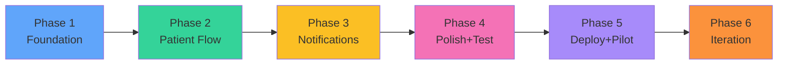

# 15_Project_Phases.md

## Overview

This document provides a detailed phase-by-phase implementation guide for DoctorQ, from foundation setup through pilot launch and iteration. Each phase includes specific tasks, deliverables, exit criteria, and estimated timeline.

## Table of Contents

1. [Phase Overview](#phase-overview)
2. [Phase 1: Foundation (Week 1-2)](#phase-1-foundation-week-1-2)
3. [Phase 2: Patient Flow (Week 3)](#phase-2-patient-flow-week-3)
4. [Phase 3: Notifications (Week 4)](#phase-3-notifications-week-4)
5. [Phase 4: Polish + Testing (Week 5)](#phase-4-polish--testing-week-5)
6. [Phase 5: Deployment + Pilot (Week 6)](#phase-5-deployment--pilot-week-6)
7. [Phase 6: Iteration (Week 7-8)](#phase-6-iteration-week-7-8)

---

## Phase Overview

### Timeline Summary

```
┌─────────────┬─────────────┬─────────────┬─────────────┬─────────────┬─────────────┐
│   Week 1-2  │   Week 3    │   Week 4    │   Week 5    │   Week 6    │  Week 7-8   │
├─────────────┼─────────────┼─────────────┼─────────────┼─────────────┼─────────────┤
│ Foundation  │Patient Flow │Notifications│Polish+Tests │Deploy+Pilot │ Iteration   │
│             │             │             │             │             │             │
│• Monorepo   │• QR Check-in│• Twilio SMS │• Error      │• Production │• WhatsApp   │
│• Database   │• Status Page│• i18n FR/AR │  Handling   │  Deploy     │• Analytics  │
│• Auth       │• Real-time  │• Templates  │• Mobile     │• 3 Clinics  │• Scale 10+  │
│• Dashboard  │• Socket.io  │• Routing    │  Polish     │• Training   │• P1 Feat.   │
│• Queue CRUD │             │• RTL        │• 80% Tests  │• Support    │             │
└─────────────┴─────────────┴─────────────┴─────────────┴─────────────┴─────────────┘
```

### Phase Dependencies



---

## Phase 1: Foundation (Week 1-2)

### Objectives

Build core infrastructure: monorepo, database, authentication, and basic queue management without real-time features.

### Tasks Breakdown

#### Week 1: Setup & Backend

**Day 1-2: Project Initialization**
- [ ] Create monorepo with pnpm workspaces
  ```bash
  mkdir doctorq && cd doctorq
  pnpm init
  mkdir -p apps/web apps/api packages/shared
  ```
- [ ] Initialize frontend (React + Vite + TypeScript + Tailwind)
  ```bash
  cd apps/web
  pnpm create vite . --template react-ts
  pnpm add tailwindcss postcss autoprefixer
  pnpx tailwindcss init -p
  ```
- [ ] Initialize backend (Node.js + Express + TypeScript)
  ```bash
  cd apps/api
  pnpm init
  pnpm add express zod bcrypt jsonwebtoken
  pnpm add -D @types/express @types/bcrypt @types/jsonwebtoken typescript tsx
  ```
- [ ] Setup ESLint + Prettier
- [ ] Configure Git hooks (Husky)
- [ ] Create `.env.example` files

**Day 3-4: Database & Models**
- [ ] Install Prisma
  ```bash
  pnpm add prisma @prisma/client
  pnpx prisma init
  ```
- [ ] Define Prisma schema (Clinic, QueueEntry, DailyStat)
- [ ] Create initial migration
  ```bash
  pnpx prisma migrate dev --name init
  ```
- [ ] Create seed script with test data
- [ ] Test database connection

**Day 5-7: Authentication**
- [ ] Create Clinic model with password hashing
- [ ] Implement JWT generation/validation
- [ ] Create authMiddleware
- [ ] Build login API endpoint (`POST /api/auth/login`)
- [ ] Build "get current user" endpoint (`GET /api/auth/me`)
- [ ] Write auth tests (unit + integration)

#### Week 2: Queue Management

**Day 8-10: Queue API**
- [ ] Create queue service layer
  ```typescript
  // queue.service.ts
  - addPatient(clinicId, data)
  - getTodayQueue(clinicId)
  - callNextPatient(clinicId)
  - updateStatus(id, status)
  - recalculatePositions(clinicId)
  ```
- [ ] Create queue repository (Prisma queries)
- [ ] Build API endpoints:
  - `GET /api/queue` - Get today's queue
  - `POST /api/queue` - Add patient
  - `POST /api/queue/next` - Call next
  - `PATCH /api/queue/:id/status` - Update status
  - `DELETE /api/queue/:id` - Remove patient
- [ ] Add Zod validation schemas
- [ ] Write queue service tests (80%+ coverage)

**Day 11-14: Frontend Dashboard**
- [ ] Create login page
- [ ] Implement AuthContext for JWT storage
- [ ] Create ProtectedRoute wrapper
- [ ] Build QueueDashboard page layout
- [ ] Create QueueList component (display only)
- [ ] Create AddPatientModal component
- [ ] Add "Call Next Patient" button
- [ ] Style with Tailwind (mobile-first)
- [ ] Add loading states and error handling

### Deliverables

**Backend:**
- ✅ Working Express API on port 3001
- ✅ PostgreSQL database with migrations
- ✅ Authentication (JWT login/logout)
- ✅ Queue CRUD operations
- ✅ Test coverage 80%+

**Frontend:**
- ✅ Login page with form validation
- ✅ Queue dashboard with list view
- ✅ Add patient modal
- ✅ Call next patient functionality
- ✅ Basic error handling

### Exit Criteria

- [ ] Receptionist can log in successfully
- [ ] Receptionist can add 5 patients manually
- [ ] Receptionist can call next patient
- [ ] Patients move from WAITING → IN_CONSULTATION → COMPLETED
- [ ] All tests passing
- [ ] No TypeScript errors
- [ ] No linting errors

### Demo

**What works:**
```
1. Login as test clinic
2. See empty queue
3. Add patient "Ahmed" with phone +21698123456
4. Add patient "Fatima" with phone +21699234567
5. See both in queue (position 1 and 2)
6. Click "Call Next"
7. Ahmed moves to "In Consultation"
8. Fatima now position 1
9. Mark Ahmed as completed
10. Call Fatima (now in consultation)
```

**What doesn't work yet:**
- ❌ Real-time updates (manual refresh needed)
- ❌ QR code check-in
- ❌ Patient status page
- ❌ SMS notifications
- ❌ French/Arabic translations

---

## Phase 2: Patient Flow (Week 3)

### Objectives

Enable patient self-check-in via QR code and build real-time patient status page with Socket.io.

### Tasks Breakdown

**Day 15-16: QR Code Check-in**
- [ ] Install QR code library
  ```bash
  pnpm add qrcode @types/qrcode
  ```
- [ ] Create QR code generation endpoint
  ```typescript
  GET /api/clinic/qr → Returns QR code PNG or URL
  ```
- [ ] Build public check-in page (`/checkin/:clinicId`)
- [ ] Create check-in form (phone + optional name)
- [ ] Validate Tunisia phone format (+216XXXXXXXX)
- [ ] Handle duplicate check-in (409 conflict)
- [ ] Redirect to patient status page after check-in

**Day 17-18: Patient Status Page**
- [ ] Create patient status page (`/patient/:entryId`)
- [ ] Build PositionCard component
  - Display position number (large)
  - Show estimated wait time
  - Calculate patients ahead
- [ ] Add progress indicator (visual queue length)
- [ ] Handle different statuses:
  - WAITING → Show position
  - NOTIFIED → "Almost your turn!"
  - IN_CONSULTATION → "YOUR TURN!" (green)
  - COMPLETED → "Thank you"
- [ ] Mobile-optimized layout

**Day 19-21: Real-time with Socket.io**
- [ ] Install Socket.io (server + client)
  ```bash
  cd apps/api && pnpm add socket.io
  cd apps/web && pnpm add socket.io-client
  ```
- [ ] Setup Socket.io server
- [ ] Create room structure:
  - `clinic:{clinicId}` for doctor dashboard
  - `patient:{entryId}` for patient status
- [ ] Implement server events:
  - `queue:updated` → Sent to clinic room
  - `patient:called` → Sent to patient room
  - `position:changed` → Sent to patient room
- [ ] Create useSocket hook (client)
- [ ] Update QueueDashboard to listen for queue:updated
- [ ] Update PatientStatusPage to listen for position:changed
- [ ] Test real-time updates (open dashboard + patient page simultaneously)
- [ ] Add fallback polling (if WebSocket fails)

### Deliverables

**Backend:**
- ✅ QR code generation API
- ✅ Public check-in endpoint
- ✅ Socket.io server with rooms
- ✅ Real-time event emission

**Frontend:**
- ✅ QR code check-in flow
- ✅ Patient status page with position
- ✅ Socket.io integration
- ✅ Real-time dashboard updates
- ✅ Real-time patient updates

### Exit Criteria

- [ ] Patient scans QR code successfully
- [ ] Patient enters phone and sees status page
- [ ] Position updates automatically without refresh
- [ ] Doctor calls next → Patient page updates instantly (< 2 seconds)
- [ ] Dashboard shows live queue without refresh
- [ ] Duplicate check-in prevented with clear message

### Demo

**End-to-end patient journey:**
```
1. Patient scans QR code with phone
2. Lands on /checkin/:clinicId page
3. Enters phone: +21698123456
4. Redirects to /patient/:entryId
5. Sees "Position #3" with estimated wait "45 min"
6. [Keep page open]
7. Doctor calls next patient (position 1)
8. Patient page updates: "Position #2" (auto-update!)
9. Doctor calls next again
10. Patient page updates: "Position #1"
11. Doctor calls next
12. Patient page turns green: "🎉 YOUR TURN!"
```

---

## Phase 3: Notifications (Week 4)

### Objectives

Implement SMS notifications via Twilio with bilingual support (French/Arabic) and RTL layout for Arabic.

### Tasks Breakdown

**Day 22-24: Twilio Integration**
- [ ] Create Twilio account
- [ ] Purchase Tunisia phone number or configure
- [ ] Install Twilio SDK
  ```bash
  pnpm add twilio
  ```
- [ ] Create notification service
  ```typescript
  // notification.service.ts
  - sendQueueJoined(entry)
  - sendAlmostTurn(entry)
  - sendYourTurn(entry)
  ```
- [ ] Implement retry logic (3 attempts, exponential backoff)
- [ ] Add delivery logging to database (optional: Notification model)
- [ ] Test SMS delivery to Tunisian numbers
- [ ] Handle Twilio errors gracefully

**Day 25-26: i18n Setup**
- [ ] Install i18next
  ```bash
  pnpm add i18next react-i18next
  ```
- [ ] Create translation files:
  - `locales/fr.json` (French)
  - `locales/ar.json` (Arabic)
- [ ] Configure i18next
- [ ] Add language switcher (for testing)
- [ ] Translate all UI strings
- [ ] Create SMS templates:
  ```typescript
  QUEUE_JOINED: {
    fr: "{{clinicName}} - Vous êtes #{{position}}. Attente: ~{{wait}}min. {{link}}",
    ar: "{{clinicName}} - أنت رقم {{position}}. الانتظار: ~{{wait}} دقيقة. {{link}}"
  }
  ```
- [ ] Test character counts (keep under 160 chars for 1 SMS)

**Day 27-28: RTL Support**
- [ ] Install Tailwind RTL plugin
  ```bash
  pnpm add tailwindcss-rtl
  ```
- [ ] Update Tailwind config
- [ ] Replace directional CSS with logical properties:
  - `ml-4` → `ms-4` (margin-inline-start)
  - `mr-4` → `me-4` (margin-inline-end)
- [ ] Set document direction based on language:
  ```typescript
  document.documentElement.dir = language === 'ar' ? 'rtl' : 'ltr';
  ```
- [ ] Test all pages in both LTR (French) and RTL (Arabic)
- [ ] Fix any layout issues

**Day 28: Notification Routing**
- [ ] Implement routing logic based on checkInMethod:
  ```typescript
  if (entry.checkInMethod === 'QR_CODE' || entry.checkInMethod === 'MANUAL') {
    sendSMS(entry.patientPhone, message);
  } else if (entry.checkInMethod === 'WHATSAPP') {
    // Future: sendWhatsApp()
    sendSMS(entry.patientPhone, message); // Fallback for now
  }
  ```
- [ ] Trigger notifications at correct times:
  - Queue joined → Immediate
  - Almost turn → When position <= 2
  - Your turn → When called by doctor
- [ ] Test notification delivery

### Deliverables

**Backend:**
- ✅ Twilio SMS integration
- ✅ Notification service with retry logic
- ✅ SMS templates (FR/AR)
- ✅ Notification routing

**Frontend:**
- ✅ i18n configuration
- ✅ French translations (100%)
- ✅ Arabic translations (100%)
- ✅ RTL layout support
- ✅ Language switcher

### Exit Criteria

- [ ] Patient receives SMS on check-in (French or Arabic)
- [ ] SMS contains correct position and link
- [ ] "Almost turn" SMS sent when position <= 2
- [ ] "Your turn" SMS sent when doctor calls
- [ ] SMS delivery rate > 95%
- [ ] All UI strings translated (FR/AR)
- [ ] Arabic pages display correctly (RTL)
- [ ] Character count ≤ 160 for all templates

### Demo

**Notification flow:**
```
1. Patient checks in via QR
2. Receives SMS: "Cabinet Dr. Ahmed - Vous êtes #5 dans la file..."
3. Waits (patient at position 5)
4. Doctor calls position 1, 2, 3 (patient now position 2)
5. Receives SMS: "⚠️ Plus que 1 patient avant vous!"
6. Doctor calls position 1 (patient now position 1)
7. Doctor clicks "Call Next"
8. Patient receives SMS: "🎉 C'EST VOTRE TOUR!"
9. Patient opens link, page is green: "YOUR TURN!"
```

**Arabic flow:**
```
1. Switch clinic language to Arabic
2. Patient checks in
3. Receives SMS in Arabic (right-to-left)
4. Opens patient page → RTL layout
5. All text in Arabic
```

---

## Phase 4: Polish + Testing (Week 5)

### Objectives

Add error handling, loading states, mobile polish, and achieve 80%+ test coverage.

### Tasks Breakdown

**Day 29-30: Error Handling**
- [ ] Add global error boundary (React)
- [ ] Implement API error handler middleware
- [ ] Create user-friendly error messages
- [ ] Add retry buttons for failed operations
- [ ] Handle offline scenarios (show offline indicator)
- [ ] Log errors to Sentry (setup)

**Day 31-32: Loading & Empty States**
- [ ] Add loading spinners for API calls
- [ ] Implement skeleton screens (queue list)
- [ ] Create empty states:
  - Empty queue: "No patients waiting"
  - No results: "No patients found"
- [ ] Add optimistic updates (add patient shows immediately)
- [ ] Disable buttons during async operations

**Day 33: Mobile Optimization**
- [ ] Test on iOS Safari (iPhone)
- [ ] Test on Android Chrome
- [ ] Fix mobile-specific issues:
  - Tap targets min 44px × 44px
  - Font sizes readable (min 16px)
  - Forms don't zoom on focus (font-size: 16px)
- [ ] Test QR code scanning with real phone
- [ ] Optimize images (compress, lazy load)

**Day 34-35: Testing**
- [ ] Write unit tests:
  - Utility functions (phone format, wait calculation)
  - Custom hooks (useQueue, useSocket)
  - Services (queue, notification, auth)
- [ ] Write integration tests:
  - API endpoints (all routes)
  - Database queries
  - Socket.io events
- [ ] Write E2E tests (Playwright):
  - Patient check-in flow
  - Doctor calls next patient flow
  - Real-time update flow
- [ ] Achieve 80%+ code coverage
- [ ] Fix failing tests

### Deliverables

**Quality:**
- ✅ Error boundaries in all routes
- ✅ User-friendly error messages
- ✅ Loading states on all async operations
- ✅ Empty states with helpful messages
- ✅ 80%+ test coverage
- ✅ All tests passing

**Mobile:**
- ✅ Responsive on iOS and Android
- ✅ Accessible tap targets
- ✅ QR scanning works
- ✅ No mobile-specific bugs

### Exit Criteria

- [ ] All error scenarios handled gracefully
- [ ] Loading indicators on all async operations
- [ ] Mobile tested on 2 devices (iOS + Android)
- [ ] Unit test coverage ≥ 80%
- [ ] Integration tests cover all API endpoints
- [ ] E2E test for critical flow passes
- [ ] No TypeScript errors
- [ ] No linting errors
- [ ] Lighthouse score > 90 (performance, accessibility)

---

## Phase 5: Deployment + Pilot (Week 6)

### Objectives

Deploy to production, onboard 3 pilot clinics, provide training and support.

### Tasks Breakdown

**Day 36-37: Production Deployment**
- [ ] Provision production database (PostgreSQL)
- [ ] Configure production environment variables
- [ ] Deploy backend to Railway/Render
- [ ] Deploy frontend to Vercel
- [ ] Configure custom domain (doctorq.tn, api.doctorq.tn)
- [ ] Setup SSL certificates
- [ ] Run database migrations on production
- [ ] Seed initial data (if needed)
- [ ] Setup error monitoring (Sentry)
- [ ] Configure analytics (Vercel Analytics)
- [ ] Test production deployment (smoke tests)

**Day 38: Pilot Clinic Setup**
- [ ] Identify 3 pilot clinics
- [ ] Create clinic accounts in production
- [ ] Generate QR codes for each clinic
- [ ] Print QR code posters (A4, laminated)
- [ ] Prepare training materials (15-min guide)
- [ ] Create WhatsApp support group

**Day 39-40: Onboarding & Training**
- [ ] Clinic 1 onboarding (30 min session):
  - Login and dashboard overview
  - Add patient manually
  - Call next patient
  - Mark completed/no-show
  - QR code installation
  - Patient experience demo
- [ ] Clinic 2 onboarding (same process)
- [ ] Clinic 3 onboarding (same process)
- [ ] Answer questions
- [ ] Provide support contact

**Day 41-42: Support & Monitoring**
- [ ] Daily check-in calls with each clinic
- [ ] Monitor error rates (Sentry)
- [ ] Monitor SMS delivery rates
- [ ] Track usage metrics:
  - Patients checked in
  - SMS sent
  - Average queue length
  - No-show rate
- [ ] Fix any critical issues immediately
- [ ] Collect feedback

### Deliverables

**Infrastructure:**
- ✅ Production backend running on Railway/Render
- ✅ Production frontend on Vercel
- ✅ Custom domain configured
- ✅ SSL certificates active
- ✅ Monitoring in place (Sentry, analytics)

**Pilot:**
- ✅ 3 clinics onboarded
- ✅ Receptionists trained
- ✅ QR codes installed
- ✅ Support system in place

### Exit Criteria

- [ ] Production deployment successful (uptime > 99%)
- [ ] 3 clinics actively using system daily
- [ ] 50+ patients checked in (total across 3 clinics)
- [ ] SMS delivery rate > 95%
- [ ] < 5 support requests per clinic per week
- [ ] 0 critical bugs
- [ ] Positive feedback from receptionists

---

## Phase 6: Iteration (Week 7-8)

### Objectives

Analyze pilot data, implement P1 features based on feedback, scale to 10 clinics.

### Tasks Breakdown

**Day 43-44: Analysis & Prioritization**
- [ ] Analyze pilot metrics:
  - Total patients/day per clinic
  - Average wait time
  - No-show rate
  - SMS costs per clinic
  - Peak hours
- [ ] Review receptionist feedback
- [ ] Identify pain points
- [ ] Prioritize P1 features:
  - WhatsApp Business API (high ROI)
  - Basic analytics dashboard
  - Printable QR poster (PDF)
  - Manual notification retry

**Day 45-48: P1 Feature Development**
- [ ] Implement WhatsApp Business API:
  - Setup Meta Business account
  - Create message templates (get approval)
  - Integrate WhatsApp Cloud API
  - Update notification routing
  - Test delivery
- [ ] Build basic analytics dashboard:
  - Today's stats (already exists)
  - 7-day trend chart
  - Peak hours visualization
  - Export to CSV
- [ ] Create printable QR poster:
  - PDF generation with clinic info
  - High-quality QR code
  - Instructions in FR/AR
  - Download button in settings

**Day 49-56: Scaling**
- [ ] Optimize SMS costs:
  - Reduce message length (abbreviate)
  - Encourage WhatsApp adoption (cheaper)
  - Monitor daily limits
- [ ] Onboard 7 more clinics (total 10):
  - 2-3 clinics per day
  - Same onboarding process
  - Group training sessions
- [ ] Monitor system performance:
  - API response times
  - Database query performance
  - WebSocket connection stability
- [ ] Scale infrastructure if needed:
  - Increase database resources
  - Add Redis for caching (if slow)

### Deliverables

**Features:**
- ✅ WhatsApp Business API integrated
- ✅ Basic analytics dashboard
- ✅ Printable QR poster (PDF)

**Scale:**
- ✅ 10 clinics actively using
- ✅ 500+ patients/week total
- ✅ System handles load (p95 < 2s)
- ✅ SMS costs optimized

### Exit Criteria

- [ ] 10 clinics onboarded and active
- [ ] WhatsApp adoption > 50% (vs SMS)
- [ ] SMS costs < 15 TND/clinic/month
- [ ] Total costs < 400 TND/month
- [ ] Revenue: 10 clinics × 50 TND = 500 TND/month
- [ ] Break-even or profitable
- [ ] System uptime > 99.5%
- [ ] Feature requests documented for v1.1

---

## Success Metrics by Phase

| Phase | Success Metric | Target |
|-------|---------------|--------|
| **Phase 1** | Queue operations work | 100% functional |
| **Phase 2** | Real-time updates latency | < 2 seconds |
| **Phase 3** | SMS delivery rate | > 95% |
| **Phase 4** | Test coverage | ≥ 80% |
| **Phase 5** | Pilot clinic satisfaction | 8/10 average |
| **Phase 6** | Active clinics | 10 |
| **Overall** | Uptime | > 99.5% |
| **Overall** | Break-even | 7-10 clinics |

---

## Risk Mitigation

### Technical Risks

| Risk | Mitigation | Phase |
|------|-----------|-------|
| **Socket.io connection failures** | Implement fallback polling | Phase 2 |
| **SMS delivery issues** | Retry logic + monitoring | Phase 3 |
| **Database performance** | Add indexes, caching | Phase 6 |
| **Security vulnerabilities** | OWASP checklist, code review | Phase 4 |

### Business Risks

| Risk | Mitigation | Phase |
|------|-----------|-------|
| **Clinic churn** | Daily support, quick fixes | Phase 5 |
| **High SMS costs** | WhatsApp adoption, optimize templates | Phase 6 |
| **Slow adoption** | Improve onboarding, add value | Phase 6 |

---

## Next Steps After Phase 6

### v1.1 Roadmap (Month 2-3)

**High Priority:**
- Multi-doctor support (P1)
- Advanced analytics (trends, insights)
- Patient feedback collection
- Automated reminders (day before)
- Email notifications (as alternative)

**Medium Priority:**
- Calendar integration (Google Calendar)
- Appointment booking (not just same-day)
- Patient accounts (optional login)
- Clinic customization (colors, logo)

**Low Priority:**
- Dark mode
- Mobile app (React Native)
- Voice notifications (phone call)
- Integration with clinic management systems

---

## Resources

- **Technical Specs**: See other docs in [docs/](./README.md)
- **Development Guide**: See [CLAUDE.md](../CLAUDE.md)
- **MVP Features**: See [MVP-SPECIFICATION.md](../MVP-SPECIFICATION.md)
- **Testing Plan**: See [12_Testing_Plan.md](./12_Testing_Plan.md)
- **Launch Checklist**: See [13_Launch_Checklist.md](./13_Launch_Checklist.md)
